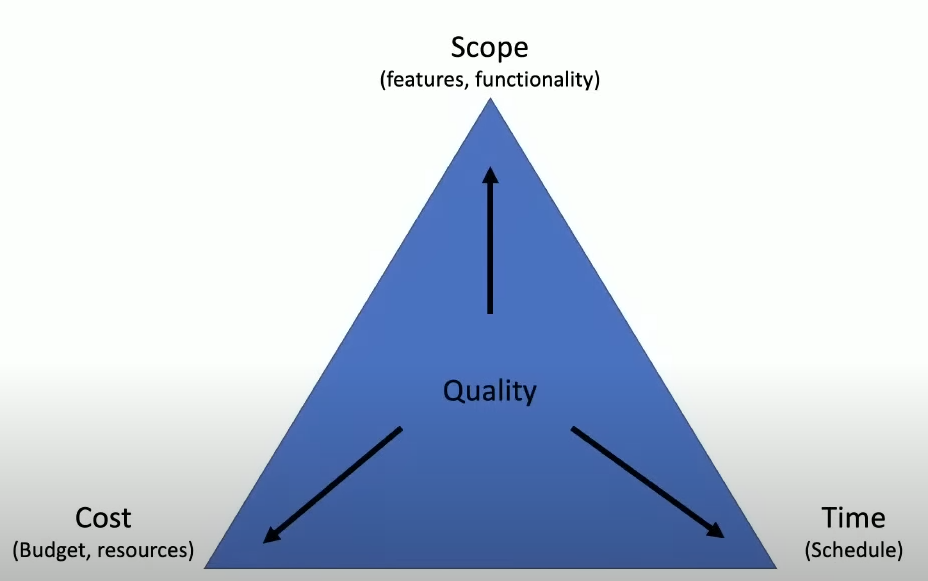

# Week 0 Notes

**What is a monolithic application?** #card
The entirety of the the stack in one place. UI, Business Logic and Database in one.

**What is a microservice architecture?** #card
Decoupling components and making them interoperable and reusable parts. You could reuse parts of your UI and make it a part of different functions and services so that it scales more easily.

- The point is that you offload complexity to the cloud as much as possible
- Separate business logic with the user interface so that if one thing breaks it doesn't all go down, it's much more resilient
- Separate the app according to responsibilities of different components so we can reuse it

**What is the iron triangle of project management?** #card
You get these three, but only choose 2 to divide up the quality.

- scope (features, functionality)
- cost (budget, resources)
- time (schedule)
  
  You can add all the features you can think of but it will get expensive. If you want something quick and cheap, you will have a very limited scope of things that you're able to build.
  You must think of the risks and rewards when taking on new components. If you're cost conscious, you have to really budget in your time and your scope.

**What is ORM?** #card
Object Relational Mapping. The layer that connects object oriented programming to relational databases. By design, you use SQL for performing CRUD operations in relational databases.

**Why create an API?** #card

- APIs connect only to the exact endpoints that you need
- It helps limit scope
- It makes it nice and flexible as microservices
- It limits your security risks as you don't have to open up a lot of things to the internet

**Why use User Personas in project planning?** #card
The personas help you remember to get the following:

- Continuity and context
- Current state
- Cost and timing
- Technical requirements and future state.
  Important because:
- Not all context is relevant
- No true "greenfield"
- Manage time and effort
- Trade offs for all projects
- Learn, iterate and show back

**Why is it important to create an architecture diagram for stakeholders?** #card
It's great for showing when you talk to anyone. If it's really complicated and has a lot of pieces you can explain why it costs so much.

- even if someone is not technical and they see a lot of lines they will go "wow it looks complicated so it is probably expensive"
- even with really technical people you can show them your architecture diagram and they go "what about this? what about that?" you get validation in the technical components
- you can show you thought through your project planning

**Why is it good to use the Iron Triangle prior to solutioning?** #card
It is the most important conversation to have to get to that because if you immediately start solutioning your technology pieces without understanding the framework of what your investors expect, what your marketers expect, what the business actually wants, then you're gonna pick something because it was your favourite toy. **There's rationale from a business perspective that dictate how your requirements, risk assumptions and constraints will be like.**

**What are project requirements?** #card
Things that the project **must** achieve. Can be technical or business oriented.
Must be:

- verifiable
- monitorable
- traceable
- **feasible**
  eg:
- meets ISO standards
- 99.9% uptime
- users can do specific tasks

**What are project risks?** #card
Risks can prevent the project from being successful (must be mitigated)

- single points of failure
- user commitment
- late delivery

**What are assumptions in projects?** #card
Assumptions are factors held as true for the planning and implementation phases

- sufficient network bandwidth
- stakeholders will be available to make decisions
- budget is approved (!)

**What are constraints in projects?** #card
Constraints are policy or technical limitations for the projects

- time
- budget
- vendor selection

**What is the first thing you should do when starting a new project?** #card
Gather requirements, risk, assumptions and constraints

**What do you do once you've gathered requirements, risk, assumptions and constraints?** #card
Iterate through the RRACs to come up with a good foundational set of requirements. From that you can start off with the design.

**How are the design frameworks layered?** #card
You start from a very high level - Conceptual Design, and from that you zoom in, with Logical and then Physical Design

**What is the Conceptual Design?** #card
business requirements translated into a common language that can be understood by the users and developers. There is no technical aspect to the conceptual design. It sketches out the basic parameters for which you want your design to work.

- created by business stakeholders and architects
- organises and defines concepts and values
- often called "Napkin Design"

**What is the Logical Design?** #card
The breaking down of large conceptual blocks into actual functional logical blocks. Can be called the blueprint. The stand from which we stand things up.

- Defines how the system should be implemented
- Environment without actual names or sizes
- Example: undeployed CFT

**What is the Physical Design?** #card
The actual house that the blueprint will make.

- Representation of the actual thing that was build
- IP addresses, EC2 instances

**What is very important to ask when gathering Requirements, Risks, Assumptions and Constraints?** #card
Ask dumb questions (not coming up from impertinence perspective):

- What is it that we're trying to do
- How do you expect this thing to make money
- What kind of skillsets do we have available internally to make this thing a reality
- Do we have to farm it out to outside sources
  These set the stage for all the deep dive questions

**What is "be the packet"?** #card
It is a game you can play. So you can pretend to be the end user with the phone and from the phone, you want to imagine what would happen if you were the packet of data going through the system you're designing.

- It enables you to find your blind spots

**What does it mean to document everything during the RRAC phase?** #card
To document in such a way that the laity could understand how everything works

**What is TOGAF?** #card

- TOGAF is an architecture framework
- It provides the methods and tools for assisting in the acceptance, production, use and maintenance of an enterprise architecture.
- It is based on an iterative process model supported by best practices and a reusable set of existing architecture assets
- The most popular framework for Enterprise Architecture
- Common dictionary fo words to convey desired outcomes
- Meta model for the creation of the underlying projects
- Maps very closely to AWS Well Architected Tool

**What is the Well Architected Framework?** #card
It is a tool within AWS to review your workload against current AWS best practices.

- workload = collection of resources and code that make up a cloud application
- asks the right questions from TOGAF perspective to highlight blind spots
- naturally falls into the RRAC buckets
- powerful tool in architect's toolbelt
- Everyone contributes

**What are the 6 pillars of the Well Architected Framework?** #card

1. Operational Excellence
2. Security
3. Reliability
4. Performance Efficiency
5. Cost Optimisation
6. Sustainability

**Why is it good to ask dumb questions?** #card
To check that you are all on the same page

**Your client wants to have 15 different data points on the user, what do you do?** #card
Collecting data on users will require instances running 24/7.
Ask WHY? Why is it needed?

- Can look at it from cost perspective, how much it will cost to keep it running. Does the big picture of WHY make it worthwhile to pay for this?
- Can look at it from sustainability perspective. Is it important enough to add to the computation needed to be done?

**What does AWS free tier mean?** #card
When you sign up, certain services with certain limitations can be used freely but we need to monitor if they go beyond the limitations as that results in charges.

**How does region affect your bills in AWS?** #card
The costs for the services are different for each region

**How can you monitor the usage on your AWS free tier account?** #card
Go to `Bills`, then click on `Free Tier` to see the usage levels

**What are the two methods of billing alerts?** #card
Under `Billing Preferences` there is `Billing Alerts` which is the old method and `Budgets` which is the new method

**Because billing is a global construct, what must you do to set up the Cloud Watch Alert?** #card
Make sure you are in the North Virginia region because the billing will not show anywhere else in other regions

**How many budgets can you set up under the free tier before it starts to charge you?** #card
2

**What are the use of cost allocation tags?** #card
If there is a big infrastructure spin up and multiple business units are utilising your AWS account or if its a landing zone or multi-account structure, tagging is useful to figure out how much nearby cost there is. You can use tags in the billing console.

**What is the use of Cost Explorer in AWS?** #card
It is useful for multiple departments or services and tracking the reserve or savings plan which is useful for costing/saving costs and creating reports for the finance team.

- You can play around with filters and settings eg daily/hourly/monthly or check out different regions, services.
- You can also generate different types of reports.

**How do you use AWS credits?** #card
Go to `Billing` and then `Credits` and then click `Redeem Credit`. Make sure to check the complete list of services because sometimes it does not apply to all the services.

**What is important to keep in mind when calculating costs for AWS services?** #card
There are 744 hours in 31 days. Amazon Pricing Calculator calculates based on 730 hours, which is an average between the different length of days in months. In the actual invoice, it will be based on the _actual_ days of the month.

**What would your responsibility as Chief Security Officer be in an organisation?** #card
To identify and inform the business on any technical risk that the business may be exposed to

**What is cloud security?** #card
Cybersecurity that protects the data, applications and services associated with cloud environments from both external and internal security threats

**Why care about cloud security?** #card

- reducing the impact of breach
- protecting networks, applications, services in cloud environments against malicious data theft
- reducing the human error responsible for data leaks

**Why does cloud security require practice?** #card

- complexity
- always chasing our tail with new services announced through the year
- bad hackers are improving their game eg with AI

**Why should you enable MFA for your root account?** #card
The root user is the most powerful user in your AWS environment with access to creating users. In case of compromise, this account is the same as domain admin in cloud world, like god level access. If someone gets access to it, it's game over

**What is the purpose of an organisation unit in AWS?** #card
It enables a governance policies across many accounts, like security, cost and billing policies

**Can you have applications in your root account in AWS?** #card
Yes but you **shouldn't**. It should only be used to create your organisation units and other users.

**What are the ways of organising your AWS organisation?** #card

1. You could create units based on business areas, eg Finance, Engineering
2. You could create units based on active or standby accounts and inside, separate them into business units. The reason is that credit card activations for new accounts may take some time. You can move an account from standby to active when needed for use.

**What is AWS CloudTrail?** #card
It is the auditing service from AWS.

- monitor data security and residence
- understand the region vs availability zone vs global services concepts
- audit logs for IR/Forensics

**Is AWS CloudTrail free?** #card
There is a free tier that expires after 30 days or once the free tier limits have been reached, whichever comes first. Limits:

- Ingest up to 5 GB of data
- Scan up to 5 GB of data
- Store data at no additional cost

**Which region is AWS IAM service available for?** #card
Global. Everyone has access

**What are the 3 recommended user groups to create in IAM?** #card

- Admin
- Engineers
- ReadOnly

**What are top 5 security best practices for AWS?** #card

- data protection & residency in accordance to security policy
- identity and access management with least privilege
- governance and compliance of AWS services being used
  - global vs regional
  - compliant services
- shared responsibility of threat detection
- incident response plans to include cloud

**What are some useful budget settings for AWS?** #card

- _Zero spend budget_ - tells you if you go over your free tier
- _Credits_ - allows you to track credit spend
- _Regular budget_ - allows you to set a budget according to costs you're comfortable with

**How do you enable auto-complete in AWS console?** #card
`aws --cli-auto-prompt`

**How do you check you are in the right account in the AWS console?** #card
`aws sts get-caller-identity`

**Where are programs usually stored when installing in Linux/Unix systems?** #card
`bin` directory

**What does `bin` stand for?** #card
Binary

**What is Binary?** #card
Binary is a program like a script that is compiled down to binary language for the computer to understand (the bare minimum way for a computer to understand a program).

**How do you see your environment variables on the terminal?** #card
Type `env` and it will list them out

**How do you find an environment variable using your terminal?** #card
`env | grep` followed by what you are searching for eg `PATH``

**What does the pipe symbol `|` mean in commands on the terminal?** #card
Take what is on the left and pass it to the program on the right

**What does `grep?` do?** #card
It is a way of searching for stuff

**How can you configure credentials using AWS CLI?** #card
`aws configure` but if you are using Gitpod, you can just use these commands to set the environment variables:

```
gp env AWS_ACCESS_KEY_ID=""
gp env AWS_SECRET_ACCESS_KEY=""
gp env AWS_DEFAULT_REGION=""
```

and ensure to wrap the values in double quotes `""` so that it doesn't get cut off at special characters. Then replace the values with the values you got when you generated security credentials on your account.

**How do you get get the output in text form rather than surrounded by `""`?** #card
adding `--output text`

**How do you set an env variable based on the output of an AWS `get-caller-identity` command?** #card
`export ENV_VARIABLE_NAME=$(aws sts get-caller-identity --query Account --output text)`
