# Week 0 — Billing and Architecture

## Required Homework

- [x] Conceptual Diagram on a Napkin
- [x] Logical Diagram on Lucidcharts
- [x] Create an admin user
- [x] Use CloudShell
- [x] Generate AWS Credentials
- [x] Install AWS CLI
- [x] Create a Billing Alarm
- [x] Create a Budget

### Conceptual Diagram on a Napkin  
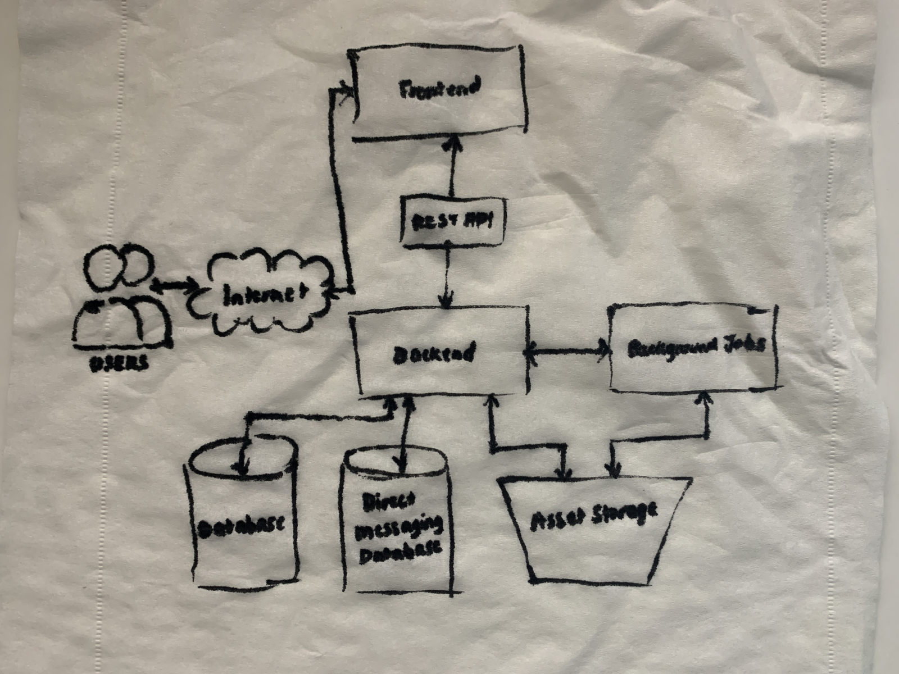

### Logical Diagram on LucidCharts  
Recreating the diagram was pretty easy for me as I often make diagrams for work on Figma, and sometimes on Mural and LucidChart.  
My recreation can be viewed [here](https://lucid.app/lucidchart/92af5eaa-4661-46af-b771-517b3f12dad0/edit?viewport_loc=-786%2C-1134%2C5120%2C2388%2C0_0&invitationId=inv_d7a5ab26-5316-45d9-8cc0-432969284034)  

### Create an admin user  
I created an Admin user group.  
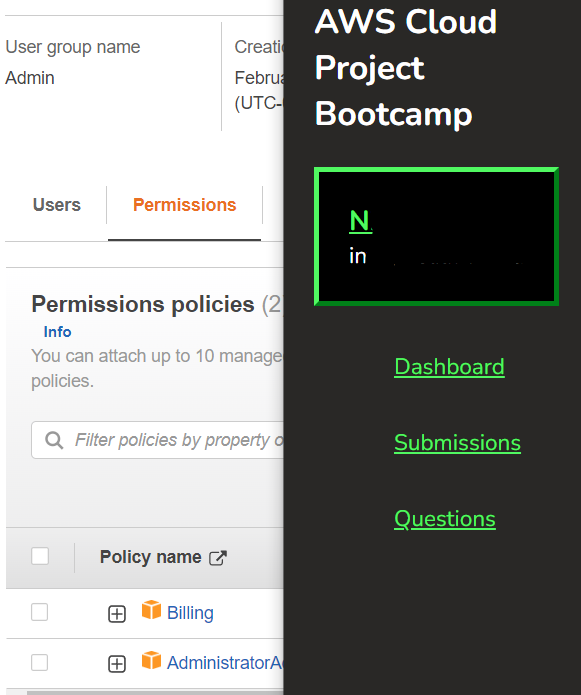  
I created a user under the Admin user group and assigned MFA for that user.  
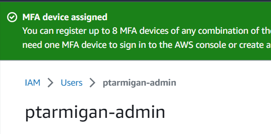  

### Use cloudshell  
I tested using cloudshell, as well as use auto prompt using this to configure: `--cli-auto-prompt`.  
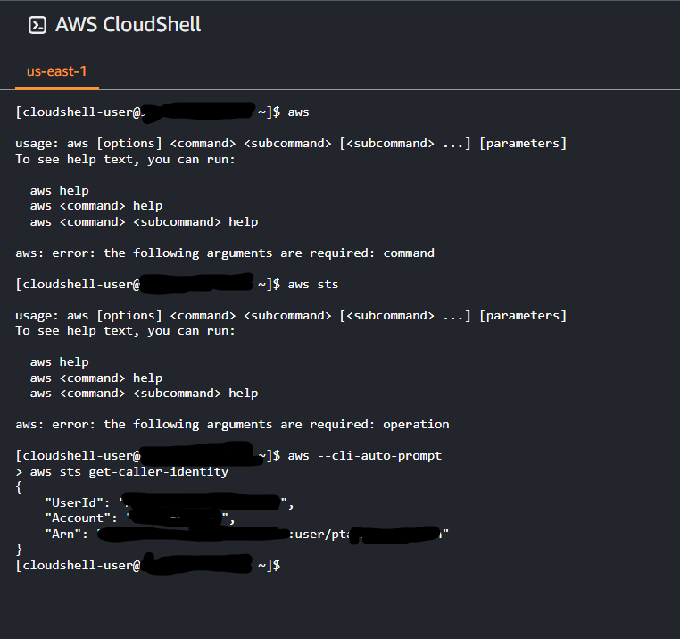  

### Generate AWS Credentials  
I generated AWS Credentials for the new user I created. Actually I had to do this twice as my copy and paste ended up copying the access key twice and missed the secret access key. It worked out in the end. I deactivated then deleted the old credentials so that there is only one.  
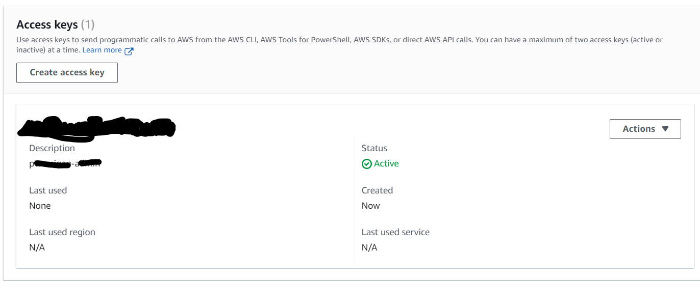  

### Install AWS CLI  
I installed the AWS CLI  
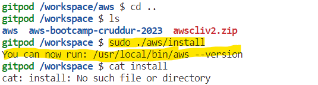  
and now it shows that I can use AWS CLI  
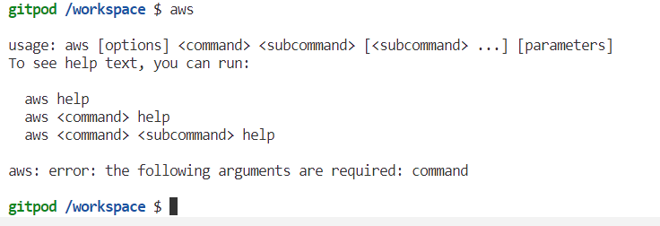  
ENV Variables needed for the AWS CLI are also now persisted across gitpod sessions  
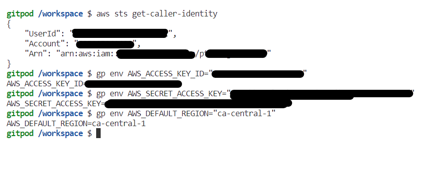  
Just to be safe, I double checked on the dashboard that they are in fact persisted  
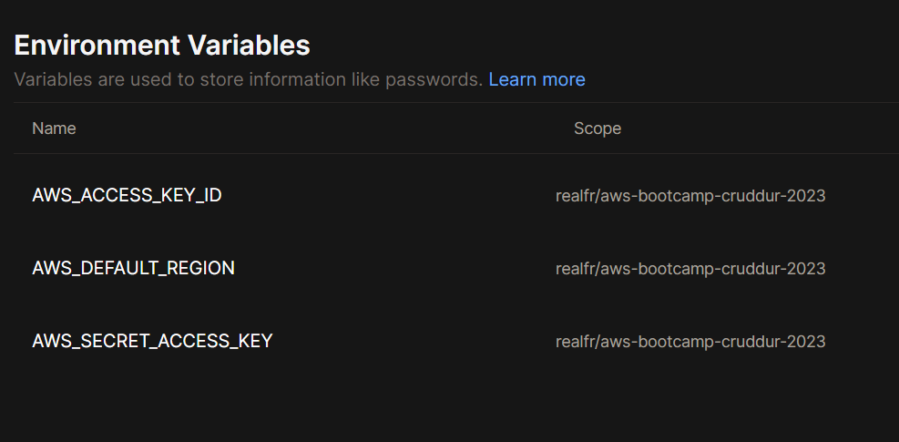  
I faced a problem with committing the `gitpod.yaml` changes, due to gitpod using my email rather than the private github email. I changed it in the dashboard, but it did not affect anything. I had to commit the changes by copying the changes I made (luckily it was only one file) and committing using VSCode.  

I knew this was going to be a problem though so I had to sort it out before proceeding further. What fixed it was adding a git config to the gitpod yaml file. I found the answer [in this github issue](https://github.com/gitpod-io/gitpod/issues/7122).  

### Create a budget  
When I was creating a budget through the CLI, I encountered an error:  
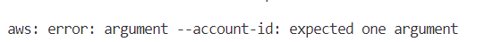  
I was able to find a solution by searching on the discord server to see if anyone else had encountered the same error. It looked like someone else did and their recommendation fixed it  
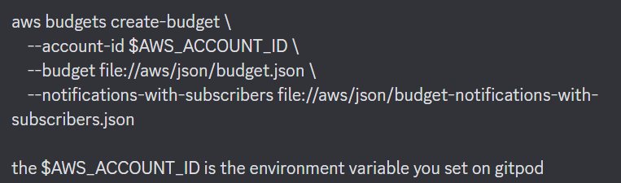  
I was then able to create a budget using the CLI  
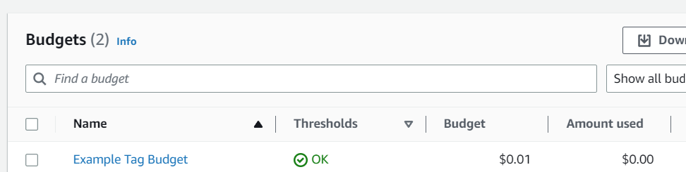  
It has an alert set  
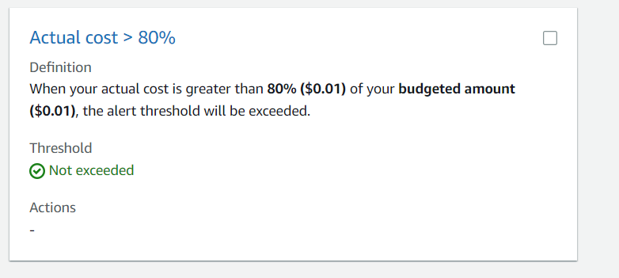  

### Create a billing alarm  
I turned on billing alarm in Billing Preferences.  
I encountered an error when I was creating a billing alarm on the CLI  
  
I edited the alarm json file to set the region to ca-central-1 which was where the Topic was created.  
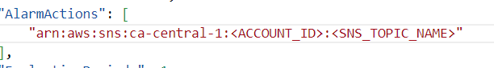  
This successfully enabled me to create an alarm  
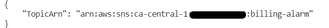  
and I was able to receive an email to confirm whether I would like to be notified! Yay!  
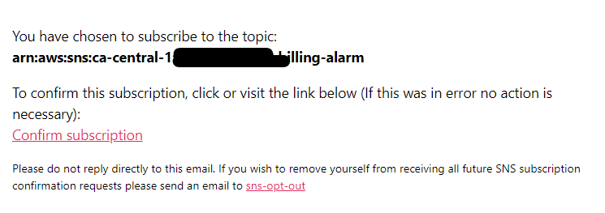  

## Recall Cards

To help me recall the knowledge gained during Week 0 of the bootcamp, I made these notes which when used in Obsidian with the Flashcards plugin, generates anki cards from my notes.

---

## Homework Challenges

- [x] Set MFA
- [x] Create an IAM Role
- [ ] Use EventBridge to hookup Health Dashboard to SNS and send notification when there is a service health issue
- [ ] Review all the questions of each pillars in the Well Architected Tool (No specialized lens)
- [ ] Create an architectural diagram (to the best of your ability) the CI/CD logical pipeline in Lucid Charts
- [ ] Research the technical and service limits of specific services and how they could impact the technical path for technical flexibility.
- [ ] Open a support ticket and request a service limit

## Notes

For the Cloud Technical Essay, I am leaning towards "Expanding on the theoretical architecture by solution architecting systems that don’t exist" or "Applied technology outside the scope of the bootcamp to the project".

Some Ideas I have for it:

- I can start a new project and apply my learnings from the bootcamp as I progress and then I can start writing about my decisions on the project repo. Then I can put all my notes together and submit it as the essay.
- I can start writing mini articles based on what I learned. For example, I could write a mini guide article that explains how to create requirements based on what I learned from the bootcamp.
