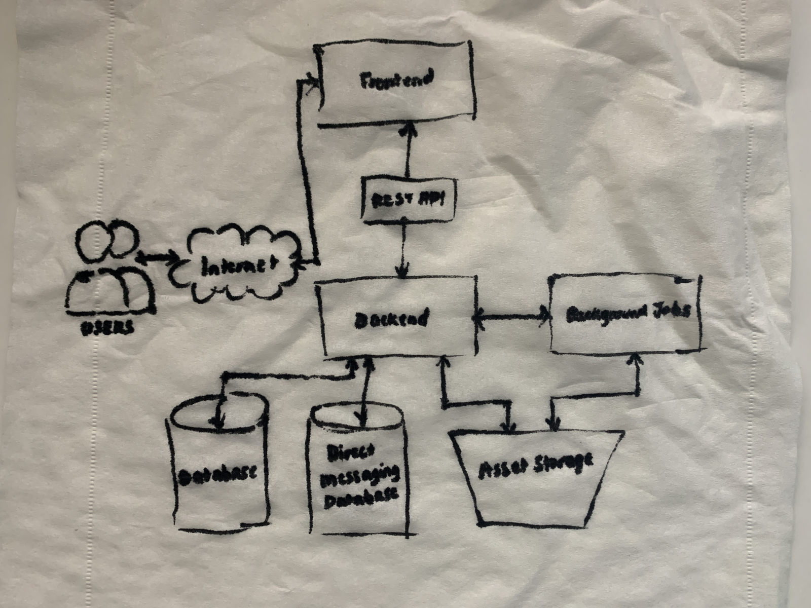

# Week 0 — Billing and Architecture

## Required Homework
- [x] Conceptual Diagram on a Napkin
- [x] Logical Diagram on Lucidcharts
- [ ] Create an admin user
- [ ] Use CloudShell
- [ ] Generate AWS Credentials
- [ ] Install AWS CLI
- [ ] Create a Billing Alarm
- [ ] Create a Budget

**Conceptual Diagram on a Napkin**

**Logical Diagram on LucidCharts**
Recreating the diagram was pretty easy for me as I often make diagrams for work on Figma, and sometimes on Mural and LucidChart.
My recreation can be viewed [here](https://lucid.app/lucidchart/92af5eaa-4661-46af-b771-517b3f12dad0/edit?viewport_loc=-786%2C-1134%2C5120%2C2388%2C0_0&invitationId=inv_d7a5ab26-5316-45d9-8cc0-432969284034)

## Homework Challenges
- [x] Set MFA
- [x] Create an IAM Role
- [ ] Use EventBridge to hookup Health Dashboard to SNS and send notification when there is a service health issue
- [ ] Review all the questions of each pillars in the Well Architected Tool (No specialized lens)
- [ ] Create an architectural diagram (to the best of your ability) the CI/CD logical pipeline in Lucid Charts
- [ ] Research the technical and service limits of specific services and how they could impact the technical path for technical flexibility. 
- [ ] Open a support ticket and request a service limit

## Notes
For the Cloud Technical Essay, I am leaning towards "Expanding on the theoretical architecture by solution architecting systems that don’t exist" or "Applied technology outside the scope of the bootcamp to the project".

Some Ideas I have for it:
- I can start a new project and apply my learnings from the bootcamp as I progress and then I can start writing about my decisions on the project repo. Then I can put all my notes together and submit it as the essay.
- I can start writing mini articles based on what I learned. For example, I could write a mini guide article that explains how to create requirements based on what I learned from the bootcamp.
