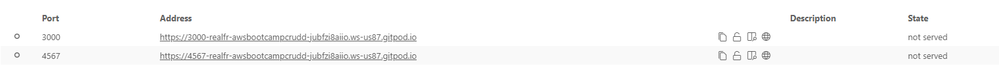
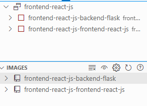
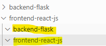
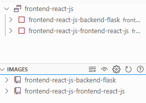
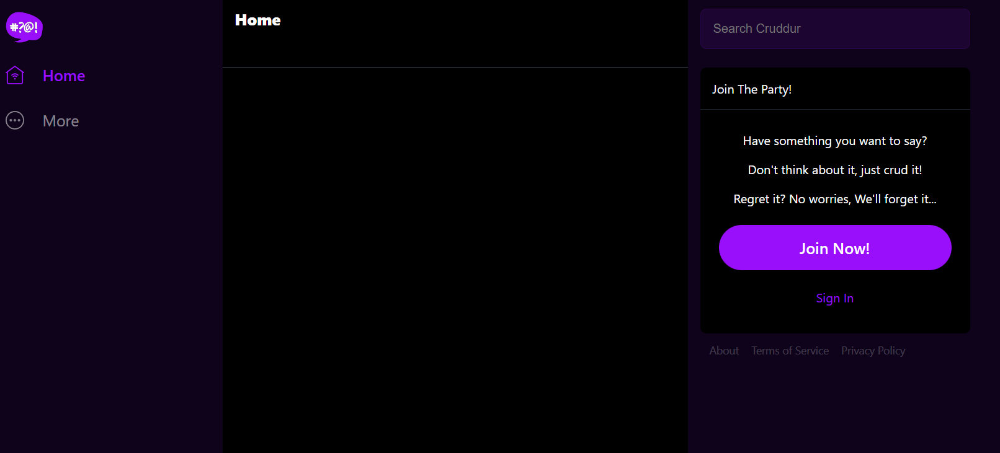
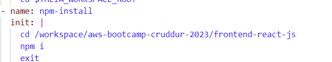
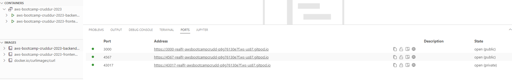
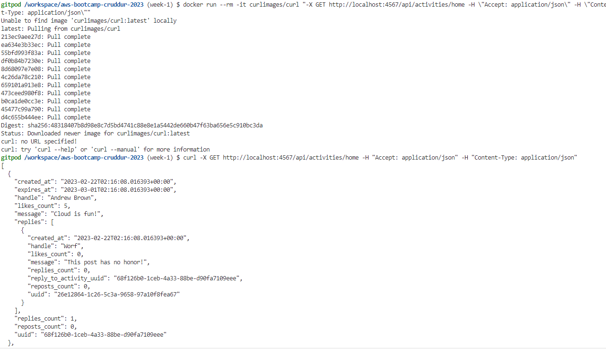
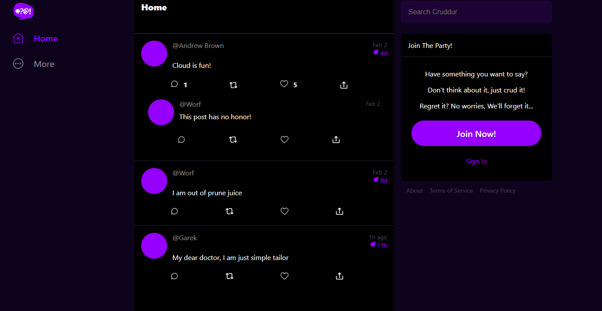

# Week 1 — App Containerization

## Required Homework

- [x] Watch How to Ask for Technical Help
- [x] Watched Grading Homework Summaries
- [x] Watched Week 1 - Live Streamed Video
- [x] Remember to Commit Your Code
- [ ] Watched Chirag's Week 1 - Spending Considerations
- [ ] Watched Ashish's Week 1 - Container Security Considerations
- [x] Containerize Application (Dockerfiles, Docker Compose)
- [ ] Document the Notification Endpoint for the OpenAI Document
- [ ] Write a Flask Backend Endpoint for Notifications
- [ ] Write a React Page for Notifications
- [ ] Run DynamoDB Local Container and ensure it works
- [ ] Run Postgres Container and ensure it works

### Containerize an application

- I was able to successfully build and run the backend container, and successfully execute this command to test the server: `curl -X GET http://localhost:4567/api/activities/home -H "Accept: application/json" -H "Content-Type: application/json"`
- I was also successfully able to receive the json data.
- I then built and ran the container for the frontend.
- When I created the `docker-compose.yml` file, I started to get these issues:
  - had problems with my ports being `not served`
    
  - containers were not running
    
  - docker compose creates `frontend-react-js` and `backend-flask` folders inside of `frontend-react-js`
    
  - this error: `TypeError: argument of type 'NoneType' is not iterable`
  - image names were appended with `frontend-react-js`
    
  - when the ports did run, the messages were not loaded
    
- What I attempted to solve these issues:

  - had to delete the inactive containers
    - `docker ps -a` to list inactive containers
    - `docker rm` followed by container ids
    - `docker images` to list images
    - `docker rmi` followed by image ids
  - had to build the frontend and backend containers and have them running in the background when I do `docker-compose up`
  - tried following instructions again from the top
  - I had to build the backend again and then run it in the background using `docker container run --rm -p 4567:4567 -e FRONTEND_URL='*' -e BACKEND_URL='*' -d backend-flask`
  - The solution
    - I added a task which tells gitpod to install dependencies. I found it on the discord.
      
    - Thanks to the help of anle4s#7774 on discord, they realised that I just had to move the `docker-compose.yml` file to the root directory.
    - I was shocked, and double checked Andre's repo and sure enough that's where it was placed. But I had been following from the video and I thought he placed it in the frontend-react-js directory (which at the time I thought was odd, since it's supposed to spin up both front and backend, but thought maybe it was just a best practice thing).
      
      
      

- I learned to never assume and also to double check the instructions because it does say to create the file at the root of the project, in the week1 journal entry in Andrew's repo.

---

## Homework Challenges

- [ ] Run the dockerfile CMD as an external script
- [ ] Push and tag a image to DockerHub (they have a free tier)
- [ ] Use multi-stage building for a Dockerfile build
- [ ] Implement a health check in the V3 Docker compose file
- [ ] Research best practices of Dockerfiles and attempt to implement it in your Dockerfile
- [ ] Learn how to install Docker on your local machine and get the same containers running outside of Gitpod / Codespaces
- [ ] Launch an EC2 instance that has docker installed, and pull a container to demonstrate you can run your own docker processes.

  ***

## Notes
